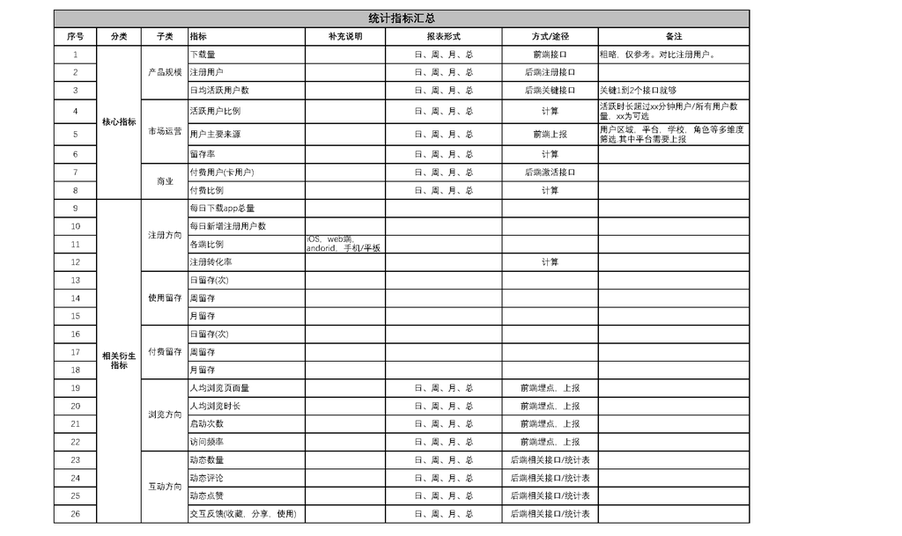
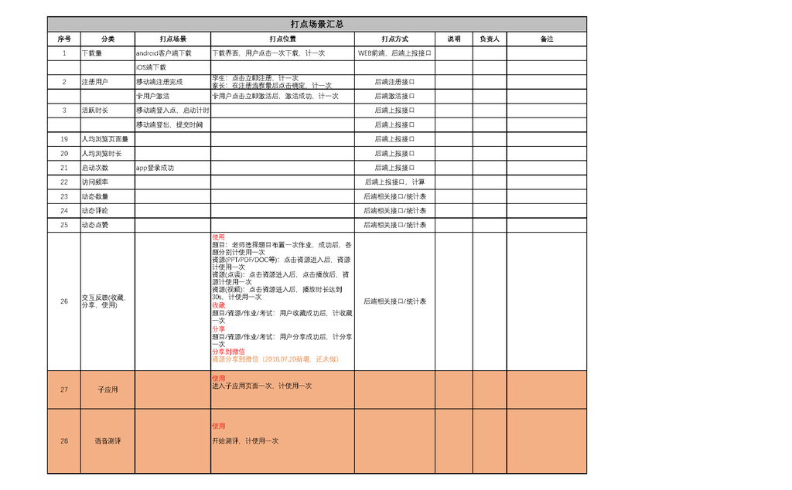
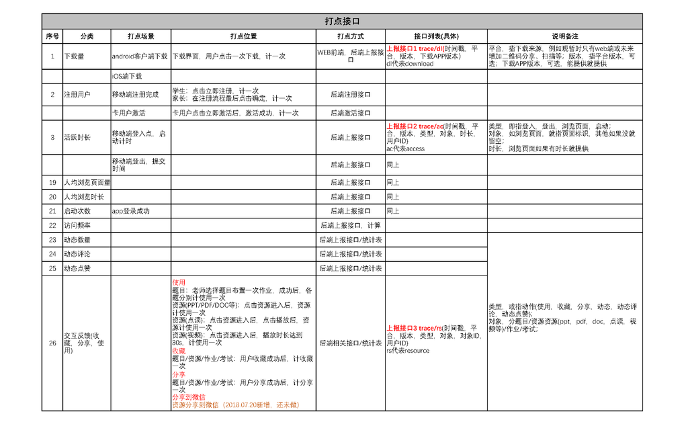
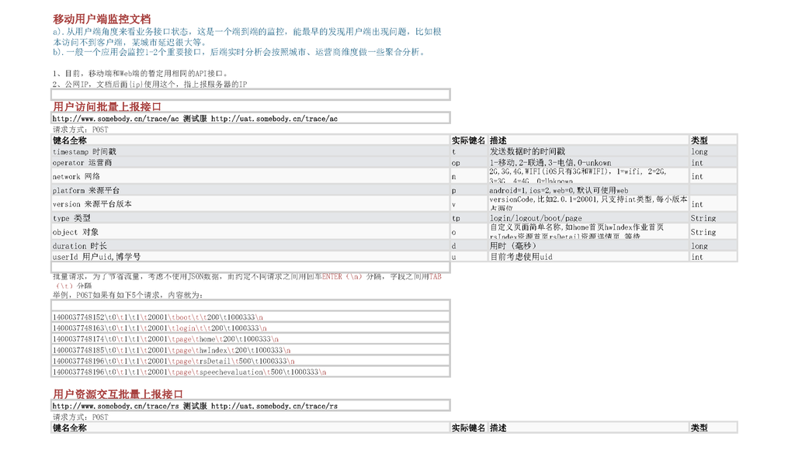
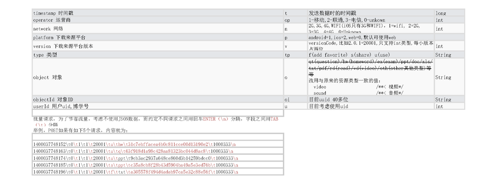

# trace-service
演示从设计到后端实现的 APP 前端到后端的行为上报服务。讨论其需求设计、数据格式等。

## 概述

数据采集和数据上报是数据平台的开始部分，通常也是大多数互联网应用到了一定阶段后必须面对的工作，它涉及产品、业务的统计分析，为开发运维、业务运营等提供支撑。业界主流已有许多讨论、分享，有确定的技术方案。

按开发实现的方式，可以项目内完全自行开发或基于开源方案整合，也可以使用第三方方案，代表有友盟， Talking Data， GrowingIO 等，两者值得注意的区别有：前者完全拥有数据，通常对需求人员、开发人员的资源耗费大，方案的成熟度在中短期偏低，业务个性化的数据易实现；后者的数据一般在第三方平台（私有化部署除外），中短期的效益非常有优势，统计分析较快速出结果，而业务个性化的数据可能需要额外的资源投入。

按数据采集埋点的方式，方案大体可归为三类（引用参考1）：

> 第一类是代码埋点，即在需要埋点的节点调用接口直接上传埋点数据，友盟、百度统计等第三方数据统计服务商大都采用这种方案；
>
> 第二类是可视化埋点，即通过可视化工具配置采集节点，在前端自动解析配置并上报埋点数据，从而实现所谓的“无痕埋点”， 代表方案是已经开源的 Mixpanel ；
>
> 第三类是“无埋点”，它并不是真正的不需要埋点，而是前端自动采集全部事件并上报埋点数据，在后端数据计算时过滤出有用数据，代表方案是国内的 GrowingIO 。

本例 trace-service 即是项目前期由需求人员和开发人员自行开发，实现代码埋点、数据上报的演示。这部分涉及的工作，需求部分通常系采用任一个方案都需要的；代码埋点部分的工作，如果下一步准备接入第三方，多数也能继续发挥作用，帮助整合。

## 详细

以下截图来源于 [docs/统计指标汇总.xlsx](docs/统计指标汇总.xlsx)

### 快速开始

参考以下 trace-service 代码项目中的编译运行指引，以及其下 sys-version/docs/scripts/demo/ 的接口请求演示：
https://github.com/mingt/sys-version/

### 需求设计

通常由 BA 业务分析人员完成，包括“统计指标”和基于具体业务给出“打点场景”列表，再交由开发人员跟进。

打点场景：

### 后端接口和数据格式

接着，后端开发人员设计和实现上报接口，注意某些指标由后端获取，某些由前端获取，也可能需要前后端结合获取。

然后，由前端做好埋点和收集，再按照约定的数据格式上报。

### 上报接口说明

* 用户访问上报接口 /trace/ac
    - 设计上有以下考虑：
        + 埋点数据可变，数量大，且上报接口属高频接口，所以要充分考虑高 QPS 和低流量，于是：（1）约定分隔符而不使用常用 json ；（2） timestamp 时间戳, operator 运营商, network 网络, platform 下载来源平台, version 下载来源平台版本等使用整型；（3）键名尽量小；（4）支持批量。在前端本地先缓冲一定量，例如固定 n 个，再一次上报；（5）可考虑压缩后请求；（6）由 BA 和开发人员确定的关键接口较重要，能提高打点统计效率和一些关键指标的准确率。
        + type 事件类型常用的有：  login 登录 pagein 进入页面 pageout 退出页面（将带有 duration 时长） btn 控件事件等。
        + 注意时间戳的情况：这个参数时间戳是前端的时间，而前端时间不能保证准确，所以仅供后续流程参考使用。请求在后端处理时，要同时录入后端服务器的时间戳，大部分统计指标记录，应该以后端服务器的时间戳为基准计算，同时后端服务器间多实例间必须做时间同步，一般的 NTP 服务即可。

* 资源交互上报接口 /trace/rs
    - 基本同上。

### 后端架构考虑

上报服务应该追求高 QPS ，高吞吐。各级缓存应用，MQ 消息队列或其他异步化措施应该必备，来优化请求响应；提供容错措施，关键上报有超时、重试，后端有限流、异常检测处理等。

## 参考

* [美团点评前端无痕埋点实践](https://tech.meituan.com/2017/03/02/mt-mobile-analytics-practice.html)
